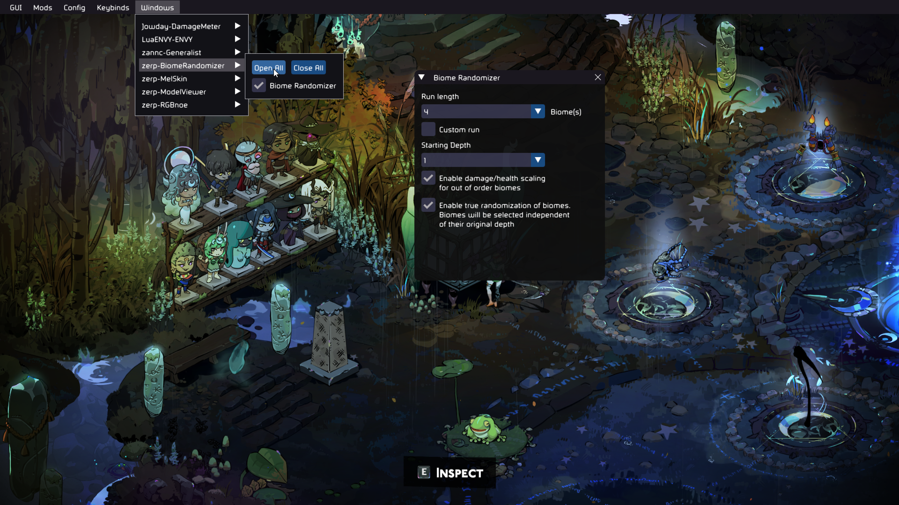
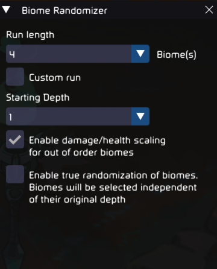
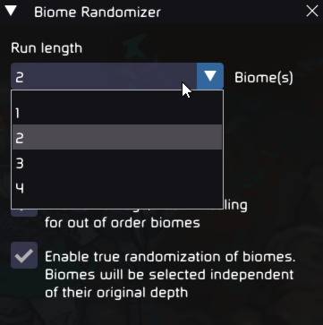
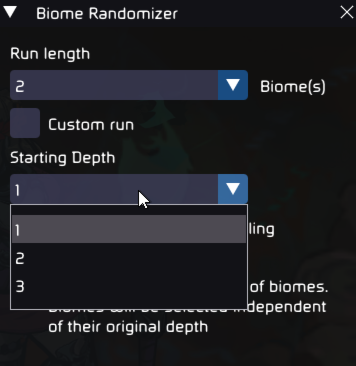
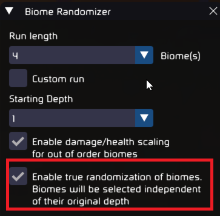
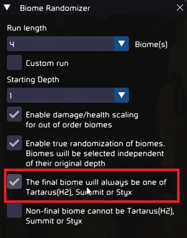
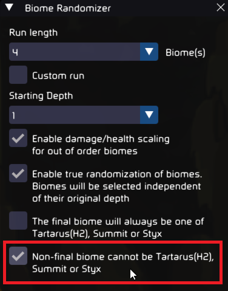
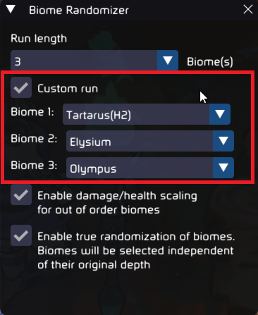

## Biome Randomizer

Adds new Chaos Trials which let's you traverse the biomes in a random order. Also supports Hades 1 biomes from [Zagreus' Journey](https://thunderstore.io/c/hades-ii/p/NikkelM/Zagreus_Journey/).

### Random Biomes Run
- Similar to a vanilla run except the biomes will be randomized. Your currently equipped loadout will used.

### Chaos Everywhere
- Similar to Chaos Above/Below but with random biomes and with your current Fear instead of 0 Fear.

### Great Chaos Everywhere
- Similar to Great Chaos Above/Below but with random biomes.

### Greater Chaos Everywhere
- Similar to Great Chaos Everywhere but with 32 Fear of random vows.

Note:
- To avoid breaking any saves this will only show up if you have already gotten the True Ending(credits) in Hades 2.
- Styx will only appear in randomizer runs after atleast one H1 clear.

|  |  | 
|-|-|
|  |  |

## Installation

Use r2modman by ebkr from [Thunderstore](https://thunderstore.io/package/ebkr/r2modman/) or [GitHub](https://github.com/ebkr/r2modmanPlus/releases/latest).

While the mod has been tested decently well, there can still be some scenarios which can break the game. It is recommended to backup your save from `%USERPROFILE%\Saved Games\Hades II\Profile*.sav` in case there are issues.

It is recommended to not uninstall or load the game un-modded while a Chaos Trial added by this mod is active.

## Configuration

Configure the randomizer using ImGui (Default imgui toggle keybind: INSERT). If the imgui windows seem unresponsive try disabling V-sync and external frame limiters if enabled.

### Default Config
Each biome is selected based on the number of bosses defeated so they appear in their respective order.

### Run length and Starting depth
Set your own run length and starting depth. 
Higher run lengths(upto 6) available for custom and true random runs. 
Starting depth only available for non custom and non true random routes.

 

### True randomizer
Enable this to get a truly random biome order. Highly recommended to keep the scaling option enabled with this mode.

### Final biome pool
Enable this to get only Tartarus, Summit or Styx as the final biome.

### Non-final biome pool
Enable this to never get Tartarus, Summit or Styx as non-final biomes.

### Custom order
Enable this to set your own biome order. Duplicate biomes are not supported.

## Contributors
- Siuhnexus, [BountyAPI](https://github.com/Siuhnexus/BountyAPI/)
- NikkelM, [Zagreus Journey](https://github.com/NikkelM/Hades-II-HadesBiomes)

## Issues and feedback

Report any issues or feedback [here](https://github.com/adi1998/BiomeRandomizer/issues) or on [Hades Modding Discord](https://discord.gg/bKvJTAJj)
