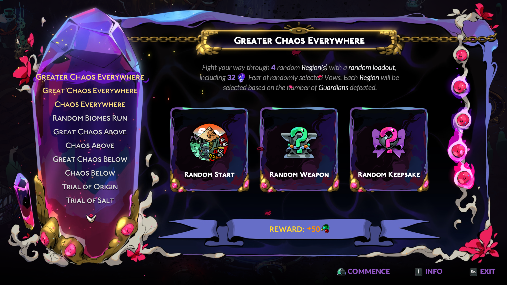

## [BETA] Biome Randomizer

Adds new Chaos Trials which let's you traverse the biomes in a random order. Each biome is selected based on the number of bosses defeated so the biomes appear in their respective order. Also supports Hades 1 biomes from [Zagreus Journey](https://thunderstore.io/c/hades-ii/p/NikkelM/Zagreus_Journey/).

### Random Biomes Run
- Similar to a vanilla run except the biomes will be randomized. Your current equipped loadout will used.

### Chaos Everywhere
- Similar to Chaos Above/Below but with random biomes and with your current Fear instead of 0 Fear.

### Great Chaos Everywhere
- Similar to Great Chaos Above/Below but with random biomes.

### Greater Chaos Everywhere
- Similar to Great Chaos Everywhere but with 32 Fear of random vows.

Note:
- To avoid breaking any saves this will only show up if you have already gotten the True Ending(credits) in Hades 2.
- Styx will only appear in randomizer runs after atleast one H1 clear.

|  |
|-|

## Installation

Use r2modman by ebkr from [Thunderstore](https://thunderstore.io/package/ebkr/r2modman/) or [GitHub](https://github.com/ebkr/r2modmanPlus/releases/latest).

While the mod has been tested decently well, there can still be some untested combination which breaks the game. It is recommended to backup your save from `%USERPROFILE%\Saved Games\Hades II\Profile*.sav` in case there are issues.

## Contributors
- Siuhnexus, [BountyAPI](https://github.com/Siuhnexus/BountyAPI/)
- NikkelM, [Zagreus Journey](https://github.com/NikkelM/Hades-II-HadesBiomes)

## Issues and feedback

Report any issues or feedback [here](https://github.com/adi1998/BiomeRandomizer/issues) or on [Hades Modding Discord](https://discord.gg/bKvJTAJj)
